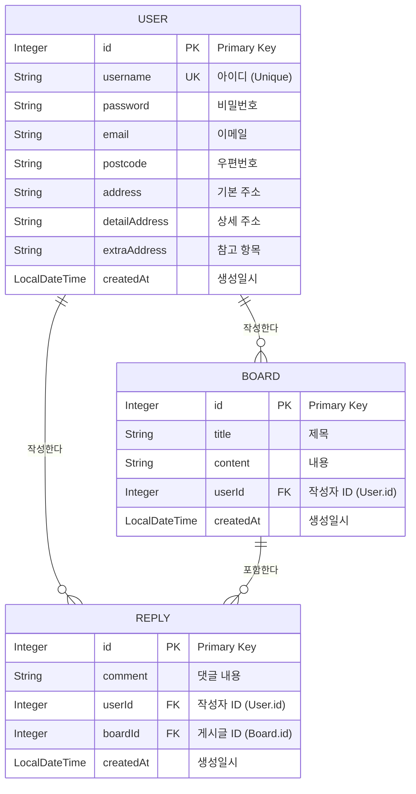

# 엔티티 관계도 (erd.md)

## 1. ER-Diagram (Mermaid)

## 2. 상세 설명

### 2.1 USER (사용자)
- 시스템의 모든 주체이며, 아이디(`username`)는 유니크해야 한다.
- 주소 정보(`postcode`, `address` 등)는 회원가입 또는 정보 수정 시 입력받는다.

### 2.2 BOARD (게시글)
- 제목과 본문으로 구성된 텍스트 기반 게시글이다.
- 작성자(`USER`)와 다대일(N:1) 관계를 맺는다.

### 2.3 REPLY (댓글)
- 게시글에 직접 달리는 1단 구조의 댓글이다.
- 작성자(`USER`), 대상 게시글(`BOARD`)과 각각 다대일(N:1) 관계를 맺는다.

## 3. 데이터 무결성 및 삭제 정책
- **Cascade Type**: `ALL` (또는 DB 수준의 `ON DELETE CASCADE`)
- **탈퇴 처리**: `USER` 삭제 시 연쇄적으로 모든 `BOARD`, `REPLY` 데이터가 물리적 삭제(Hard Delete)된다.
- **게시글 삭제**: `BOARD` 삭제 시 해당 게시글의 모든 `REPLY`가 함께 삭제된다.
